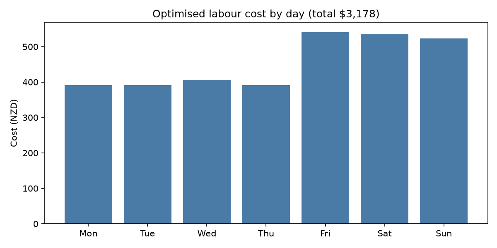

# Shift Rostering Optimiser

A mixed-integer linear programming (MILP) model that builds the cheapest legal weekly staff roster for a small hospitality venue, subject to coverage, availability, skill-mix and fatigue constraints.

Built in Python with PuLP (CBC solver).

## The problem

Rostering is a classic operations research problem. A manager must decide who works which shift, balancing:

- **Cost** — staff have different hourly rates
- **Coverage** — busy shifts need more people
- **Availability** — staff have study, other jobs, commitments
- **Skill mix** — every shift needs a supervisor on the floor
- **Fatigue and legal limits** — hour caps, no back-to-back doubles

Done by hand this takes a manager hours a week and rarely finds the true optimum. This model solves it in under a second.

## The model

**Decision variables**

`x[w,s] ∈ {0,1}` — 1 if worker *w* is assigned to shift *s*, 0 otherwise.
With 6 staff and 14 shifts (Lunch/Dinner × 7 days), that's 84 binary variables.

**Objective**

Minimise the total wage bill:

```
min  Σ_w Σ_s  (rate_w × hours_s) × x[w,s]
```

**Constraints**

| Constraint | Formulation |
|---|---|
| Coverage | `Σ_w x[w,s] ≥ required_s` for every shift *s* |
| Availability | `x[w,s] = 0` for unavailable pairs |
| Max hours | `Σ_s hours_s × x[w,s] ≤ 30` for every worker *w* |
| Skill mix | `Σ_(w ∈ supervisors) x[w,s] ≥ 1` for every shift *s* |
| Rest | `x[w,(d,Lunch)] + x[w,(d,Dinner)] ≤ 1` for every worker and day |

## Results

| Model | Weekly cost | Valid? |
|---|---|---|
| Coverage only | $3,032 | No — two staff worked 12 shifts each, no supervisor rostered |
| Full model | $3,178 | Yes |

The naive cost-only solution is $146 cheaper but unusable: it loads every shift onto the two lowest-paid staff, breaches hour limits, and leaves the floor unsupervised. **Realism costs 4.8% of the wage bill** — a concrete number a manager can reason about.



## A note on infeasibility

With only two supervisors the model returned **infeasible** (status -1). This wasn't a bug — it was the model proving no valid roster existed. One supervisor was unavailable all Sunday, forcing the other to cover both Sunday shifts, which the no-doubles rule forbids.

The fix was a business decision, not a code change: promote a third supervisor. This is one of the more useful properties of a constrained optimisation model — it doesn't just find good rosters, it can prove when your staffing structure makes a valid roster impossible.

## Running it

```bash
pip install -r requirements.txt
python roster.py
```

Outputs the roster grid, a per-worker hours/pay summary, and saves `roster_cost.png`.

## Limitations and extensions

- **Solver** — CBC is free and fine at this scale. Production rostering at enterprise scale typically uses Gurobi or CPLEX.
- **Scope** — this is the optimisation engine, not a workforce-management system. Real deployments wrap the solver in a database, HR integration and a manager-facing UI.
- **Fairness** — the model minimises cost only. It has no notion of distributing shifts equitably; a fairness term or minimum-shifts-per-worker constraint would be a natural extension.
- **Preferences** — staff shift preferences could be added as soft constraints with penalty weights rather than hard availability rules.
- **Demand** — coverage requirements are assumed known. In practice they'd be forecast from historical sales data.

